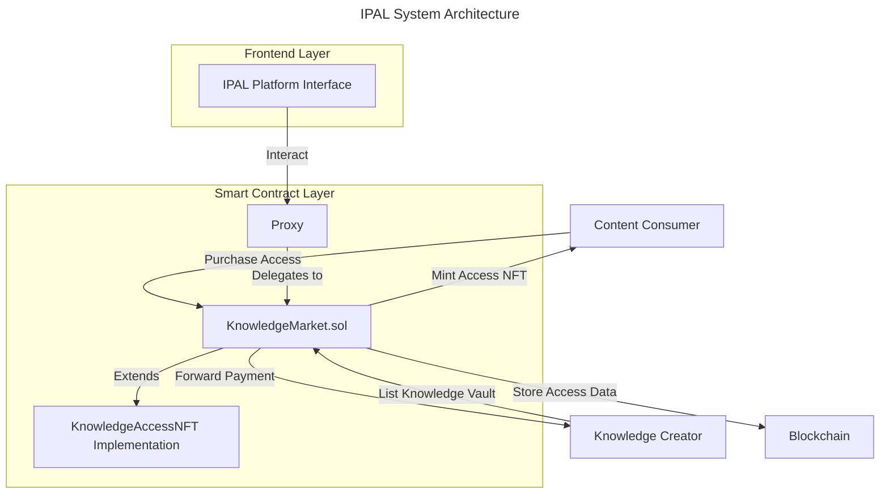
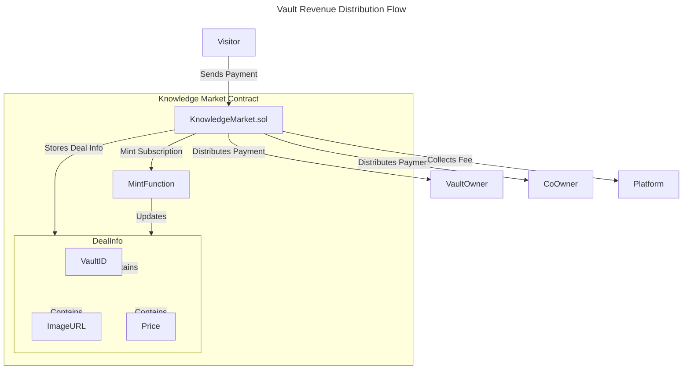
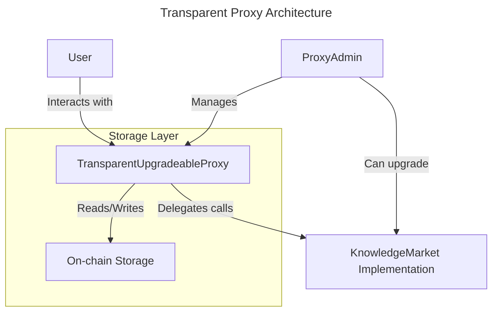
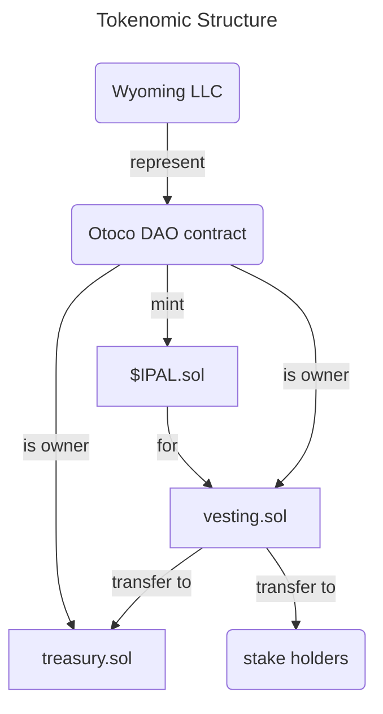
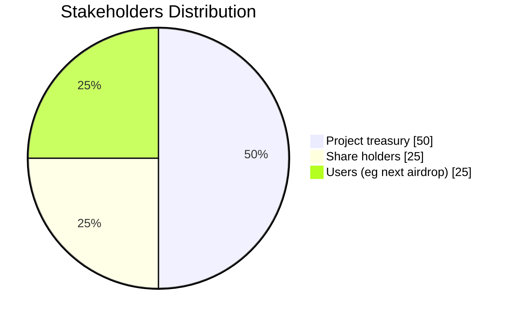

# IPAL: Decentralized Knowledge Market
## White Paper v1.1

## Abstract

[Ipal network](https://ipal.network) introduces a revolutionary decentralized marketplace for knowledge exchange using blockchain technology. This white paper outlines the technical architecture and tokenomics of the IPAL platform, focusing on the fully implemented NFT-gated access system and the upcoming $IPAL token ecosystems. The platform enables content creators to monetize their knowledge while providing consumers with verifiable, immutable access rights through a transparent and secure mechanism.

---

## Table of Contents

1. [Introduction](#introduction)
2. [Technical Architecture](#technical-architecture)
3. [NFT-Gated Access System](#nft-gated-access-system)
4. [Smart Contract Implementation](#smart-contract-implementation)
5. [$IPAL Token (Draft)](#ipal-token-draft)
6. [Roadmap](#roadmap)
7. [Conclusion](#conclusion)

---

## Introduction

In the current digital economy, knowledge creation and sharing face multiple challenges: centralized platforms extracting excessive fees, lack of ownership verification, and payment inefficiencies. IPAL addresses these challenges by creating a decentralized marketplace where creators maintain control over their knowledge assets while consumers gain transparent, verifiable access rights.

The IPAL ecosystem consists of two main components:
- **KnowledgeMarket Contract**: A fully implemented smart contract that manages access NFTs for knowledge vaults
- **$IPAL Token**: Used as placeholder for upcoming governance and utility token systems (currently in development)

---

## Technical Architecture

IPAL's architecture is built on Ethereum smart contracts that extend the ERC721 standard to support time-limited access controls. This design enables secure, transparent, and efficient knowledge exchange without intermediaries.

---

## NFT-Gated Access System

The core of IPAL's functionality is the NFT-gated access system, enabling knowledge creators to sell access to their content through time-limited NFTs. When a consumer purchases access, they receive an NFT representing their access rights to specific knowledge vaults. The payment is automatically split by the smart contract: the vault owner receives the main share, a co-owner (if defined) receives a portion, and a small platform fee is collected. This ensures transparent and automated revenue distribution without intermediaries.

### Vault Owner Revenue Flow

### DealInfo: On-Chain Access Records

The `DealInfo` data structure plays a critical role in IPAL's ecosystem. It stores key transaction details on the blockchain, including:

- **VaultID**: Unique identifier for the knowledge vault
- **ImageURL**: Visual representation of the vault content
- **Price**: Cost paid for access

By storing these details on-chain, IPAL ensures complete transparency and immutability of access transactions. This approach:

1. **Enhances Asset Liquidity**: Investors and users can easily verify the value and authenticity of access rights
2. **Guarantees Immutability**: Once recorded, access details cannot be altered
3. **Creates Trustless Verification**: Any party can independently verify access rights
4. **Protects Creators**: Provides permanent record of ownership and access grants

---

## Smart Contract Implementation

The KnowledgeMarket contract implements several key features:

**Update July 2025**  
The `KnowledgeMarket` contract has been enhanced to support:  
- **Co-ownership** of subscriptions, allowing one address to share management of a vault  
- **Platform fee splitting**, enabling automatic distribution of revenue between primary and co-owners  
- **Improved metadata handling**, with richer on-chain data for vaults and subscription NFTs  

### Subscription Management
Vault owners can:
- Register a vault on-chain, establishing ownership and metadata.
- Create subscription offerings (pricing, duration, co-owner share) linked to their registered vault.
- Offer free (zero-price) access when appropriate.
- Update or remove subscription offerings at any time.
- Customize the visual representation of their content.

### Access Control
The contract provides:
- Time-limited access to vaults based on NFT ownership
- Verification methods to check access rights
- Access expiration based on predefined durations
- Add a Co-Owner, allow access for free and assign a % of generated fees (if desired) 

### NFT Representation
Each access NFT includes:
- On-chain metadata about the knowledge vault
- Visual representation of the content
- Expiration information
- Ownership verification

### Security Features
The contract implements multiple security measures:
- Reentrancy protection for all state-changing functions
- Input validation for all parameters
- Zero-address checking
- Custom error handling
- Event emission for important state changes

### Proxy Pattern Implementation
The IPAL platform utilizes a transparent upgradeable proxy pattern that:
- Provides a consistent interface for users
- Enables interaction with the KnowledgeMarket contract
- Maintains a standardized access point
- Supports future upgradability while preserving the same contract address
- Allows the team to fix potential bugs or add features without disruption to users

#### Transparent Proxy Architecture
The proxy architecture consists of three main components:
1. **KnowledgeMarket (Implementation)**: Contains the core business logic
2. **TransparentUpgradeableProxy**: Forwards calls to the implementation while keeping its address constant
3. **ProxyAdmin**: Manages proxy administration, including upgrades to new implementations

This architecture follows the EIP-1967 standard for proxy storage slots, ensuring compatibility with block explorers and wallet providers.

Benefits of this architecture:
- **Immutable User-Facing Address**: The proxy address remains constant, simplifying integrations
- **Seamless Upgrades**: Implementation can be upgraded without affecting user experience
- **Separation of Concerns**: Admin functions are isolated in a separate contract for security
- **Future-Proofing**: Allows for bug fixes and feature additions without redeployment

---

## $IPAL Token (Draft)

> Note: This section represents planned functionality that is currently under development.

A token can serve as both a governance and utility token within the ecosystem. Token holders can be enabled to participate in platform governance, receive rewards, and access premium features.

### Tokenomics

### Token Distribution

The planned token distribution ensures a balanced ecosystem that rewards early contributors while maintaining sufficient project treasury for ongoing development and marketing efforts.

---

## Roadmap

IPAL's development roadmap includes:

1. **Q3 2024 (Completed)**
   - KnowledgeAccessNFT standard implementation
   - KnowledgeMarket contract development

2. **Q4 2024 (Completed)**
   - Frontend application development
   - Smart contract security assessment

3. **Q1 2025 (Completed)**
   - Platform optimization
   - NFT marketplace integration
   - Implementation of proxy pattern

4. **Q2 2025 (Completed)**
   - Initial creator onboarding
   - Governance model implementation

5. **Q3 2025 (Current)**
   - Smart Contract Audit
   - e2e Testing, prepare for Mainnet launch
   - KnowledgeMarket contract deployment on Base chain
   - Mainnet launch

6. **Q4 2025 (Planned)**
   - Launch first joint ventures
   - Stay tuned for more

---

## Conclusion

IPAL represents a significant advancement in decentralized knowledge exchange. Through its NFT-gated access system, IPAL creates a transparent, secure marketplace where knowledge creators can monetize their expertise and consumers can gain verified access to valuable content.

With the fully implemented KnowledgeMarket contract, IPAL is positioned to become a leading platform in the Web3 knowledge economy, fostering a community-driven ecosystem that rewards creators fairly while providing consumers with verifiable access rights.

---

## Contract Deployments 

### Base Mainnet
- KnowledgeMarket Proxy: [0x3C9F08ac809068C3c7bBF98c86976A436106bbbb](https://basescan.org/address/0x3C9F08ac809068C3c7bBF98c86976A436106bbbb)
- KnowledgeMarket Implementation: [0xCf7135420e083b14841c801B1eeDCAA59e4A7B21](https://basescan.org/address/0xCf7135420e083b14841c801B1eeDCAA59e4A7B21)
- ProxyAdmin: [0x8A61c3a136cc77019Bf706CB3f0518CBc8c7E55F](https://basescan.org/address/0x8A61c3a136cc77019Bf706CB3f0518CBc8c7E55F)

### Base Sepolia (Testnet)
- KnowledgeMarket Proxy: [0xd6D8BdB1e53571A46F824E2a2B5D13580B1abf9f](https://sepolia.basescan.org/address/0xd6D8BdB1e53571A46F824E2a2B5D13580B1abf9f)
- KnowledgeMarket Implementation: [0xFc1235cF3f901907cFC71CdC0762630561F23B93](https://sepolia.basescan.org/address/0xFc1235cF3f901907cFC71CdC0762630561F23B93)
- ProxyAdmin: [0x25677f7Ae0363a430D257D00B8720Bf3B74b6259](https://sepolia.basescan.org/address/0x25677f7Ae0363a430D257D00B8720Bf3B74b6259)

---

## Contact

For more information about IPAL, please visit our website or contact our team:

- Website: [https://ipal.network](https://ipal.network)
- X: [@ipalNetwork](https://x.com/ipalNetwork)
- Telegram: [private group](https://t.me/+wrJscoA5409iN2Yy)
